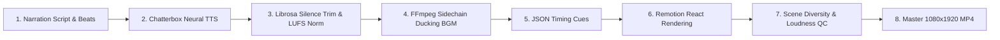

# NEMI EXPLAINS — AUTOMATION ENGINE & RENDERING PIPELINE

## 1. End-to-End Autonomous Pipeline Architecture
The Nemi Explains production engine is completely automated:



---

## 2. Production CLI Commands
```bash
# 1. Generate Voice, BGM, and JSON Timing Cues
python3 scripts/generate_nemi_v7_audio.py

# 2. Run Automated Scene Diversity & Pacing QA
python3 scripts/scene_diversity_v7_check.py

# 3. Render Master Production MP4
npx remotion render src/index.ts NemiExplainsV7 out/NemiExplains_07.mp4

# 4. Measure Broadcast Loudness & Peak Headroom
ffmpeg -i out/NemiExplains_07.mp4 -af "loudnorm=print_format=json" -f null -
```
